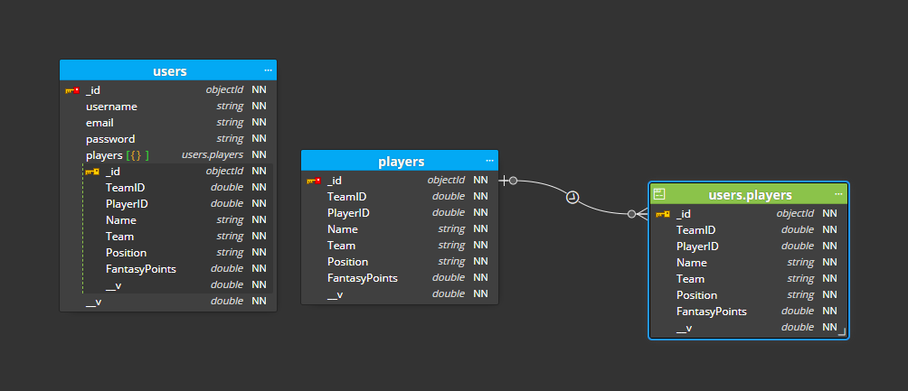
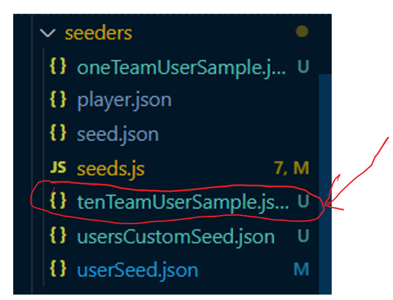

# WhoYaGot, Reverse Engineering Database
 

# WhoYaGot, 10 Sample Of User Full Team Build Database
## go in the server side folder and enter from the (CLI) in the terminal: npm run seed
 
### You can use the tenTeamUserSample.json file to test your login on our Web site, and you're able to do the Query Appolo graphql

# WhoYaGot and all the links-
* [WhoYaGot-Login  Git Hub](https://github.com/willycoxy/WhoYaGot)
* [WhoYaGot-Login Heroku]()